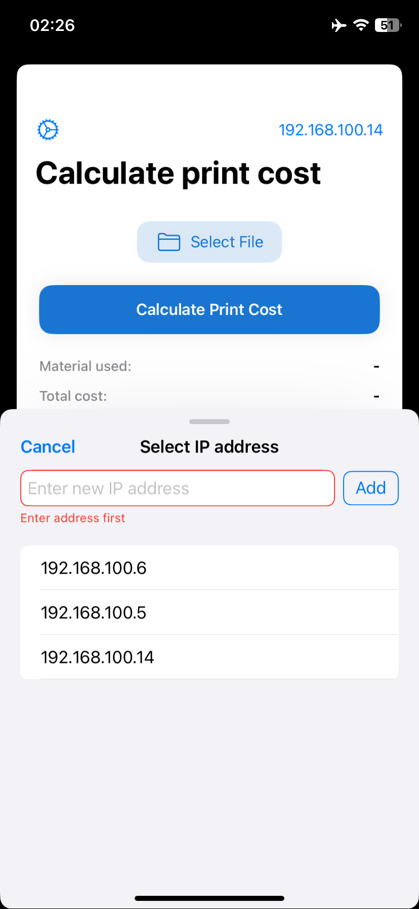
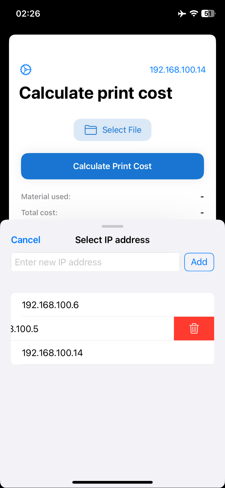
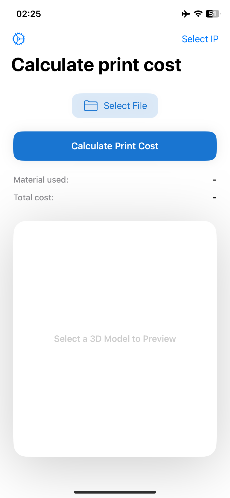

## 3D Print Client (iOS)
Часть пет-проекта, ios-клиент.

Основной стек: Swift, UIKit, SceneKit.

  
  
  
  

 
Приложение позволяет пользователю загрузить свою 3д-модель и узнать итоговую цену 3D-печати с высокой точностью без необходимости взаимодействовать с персоналом сервиса.
 
 
Функционал: 

- Выбор 3D-модели из файла
- Просмотр выбранной модели:
    - Масштабирование
    - Вращение модели
- Ввод адреса сервера
- Загрузка модели на сервер
- Получение ответа от сервера и отображение стоимости печати загруженной модели
- Выбор другой 3D-модели:
    - Старая модель удаляется из предпросмотра
    - Отображается новая загруженная модель
    
 
• • • • • • • • • • • • • •

• • • • • • • • • • • • • •

 

### Описание решаемой проблемы:
Быстро узнать цену 3D-печати нужной модели на заказ практически невозможно. В поисковой выдаче по запросу "3D-печать на заказ <город>" большинство сайтов либо позволяют только оформить заявку с последующим рассмотрением менеджерами, либо указывают лишь цену печати за 1 грамм материала без учета особенностей модели.
### Решение проблемы:
Создание системы со следующим принципом работы: 
1. Клиент (web, mobile) позволяет пользователю загрузить имеющуюся 3D-модель из файла.
2. Затем клиент отправляет модель на сервер.
3.Сервер нарезает модель, как это делает слайсер (ПО для подготовки модели к 3D-печати), и извлекает из полученного файла объем израсходованного материала в мм³.
4. Сервер отправляет полученные данные обратно клиенту
5. Клиент получает значение и рассчитывает итоговую стоимость печати по заранее заданной формуле, учитывая цену пластика и наценку.

---

## 3D Print Client (iOS) 
Part of a pet project. iOS Client for 3D Printing Services.

**Tech Stack**: Swift, UIKit, SceneKit.

  
  
  
  

 
The app allows users to upload a 3D model and instantly calculate the exact price of 3D printing without needing to contact service staff.
 
 
Features: 

- Select a 3D model from a file
- Preview the selected model:  
    - Zoom in/out  
    - Rotate the model  
- Enter server address  
- Upload the model to the server  
- Receive a response from the server and display the printing cost  
- Switch to another 3D model:  
    - Previous model is removed from the preview  
    - Newly uploaded model is displayed  

 
• • • • • • • • • • • • • •

• • • • • • • • • • • • • •

 

#### Problem Statement  
It’s nearly impossible to quickly estimate the cost of custom 3D printing for a specific model. Search results for "custom 3D printing in <city>" typically show websites that either:  
- Require submitting a request for manual review by managers, or  
- Only display the price per gram of material without considering the model’s complexity.  

#### Solution  

A system with the following workflow: 

1. **Client** (web/mobile): Lets users upload a 3D model from a file.  
2. The client sends the model to the **server**.  
3. **Server**: Slices the model (similar to slicer software used in 3D printing preparation) and calculates the material volume in mm³.  
4. The server returns the extracted data to the client.  
5. **Client**: Calculates the final cost using a predefined formula that accounts for material price and markup.  